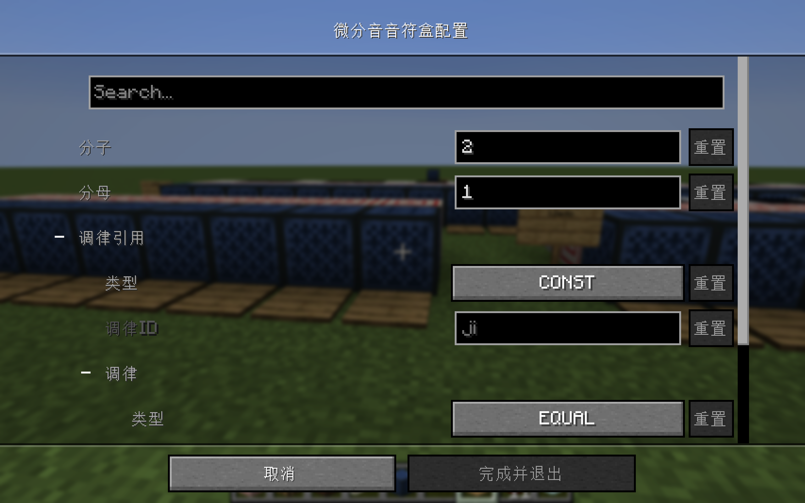
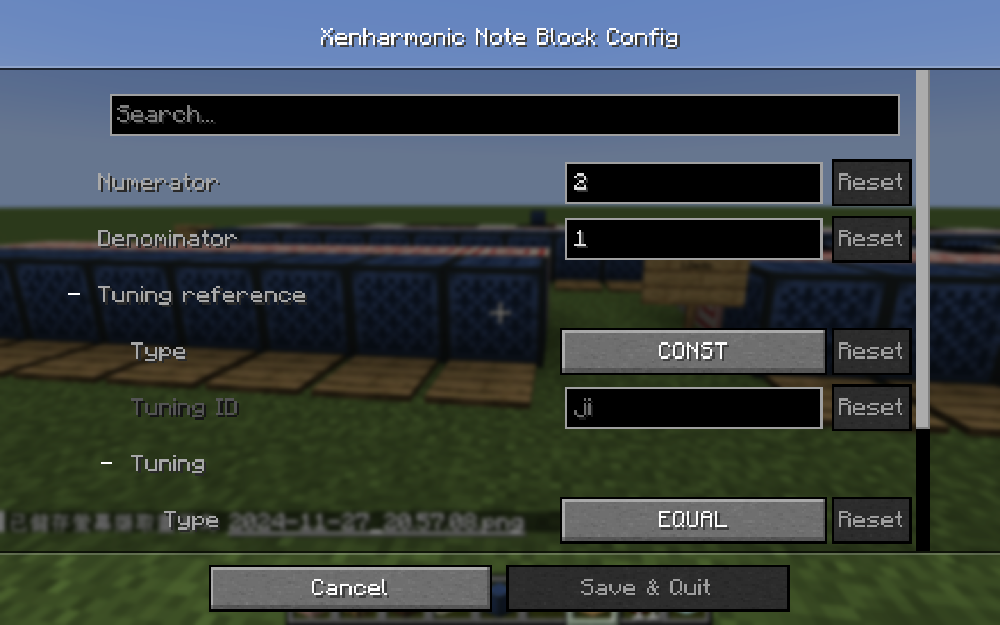

[中文](#中文)
[English](#english)

## 中文
XenNote是一个为Minecraft添加微分音支持的Fabric mod。

支持游戏版本：1.21~1.21.3

依赖：Cloth Config API

详细资料见[Wiki](https://github.com/zhenlige/xennote/wiki)。

## English
XenNote is a Fabric mod which adds xenharmonic support to Minecraft.

Supporting game versions: 1.21~1.21.3

Require: Cloth Config API

For details, see the [Wiki](https://github.com/zhenlige/xennote/wiki).